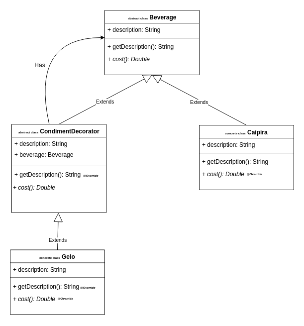

# Pattern: Decorator - Exercises

- O Ressaca’s é o bar de maior sucesso da região. A razão é a variada oferta de drinks a disposição dos clientes. Por outro lado, o sistema de pedidos do bar se tornou mais complexo e está difícil mantê-lo por conta da grande variedade de drinks.
- O problema é que a pedido dos clientes, novos drinks foram criados pela adição de diferentes aditivos aos drinks existentes.
- Os projetistas criaram novas classes para representar os novos drinks e calcular os preços de cada um deles levando em conta os diferentes ingredientes.
- Em decorrência houve uma verdadeira explosão de classes para representar os diferentes tipos de drinks

## Seu objetivo
- Apresentar o seu projeto (Diagrama de Classes) e Implementar o sistema Drinks do Ressaca's Bar, usando o padrão Decorator.
- Imagine que você tem um drink chamado caipira, que custa 3,0 reais, porém quando o cliente vai montando a sua caipira ele vai aumentando o preço.
- Quero uma caipira de saquê, abacaxi, kiwi e açúcar
- Quero uma caipira de vodka, morango e adoçante
- Quero uma caipirinha (que é um drink pronto que não pode ser
alterado – cachaça, limão, gelo e açúcar)

## Diagrama

