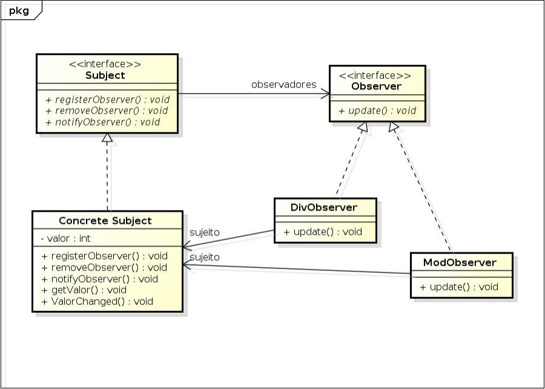

# Pattern: Observer - Exercises

- No esquema acima, o padrão observer é utilizado para realizar as
operações de divisões inteiras e resto de divisão.
- Cada vez que os valores no sujeito são atualizados, as operações
devem ser realizadas e seus resultados atualizados apresentados.